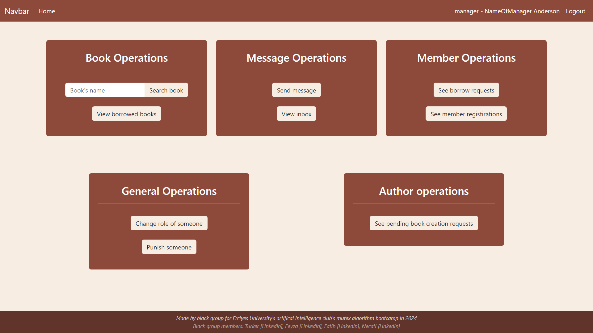
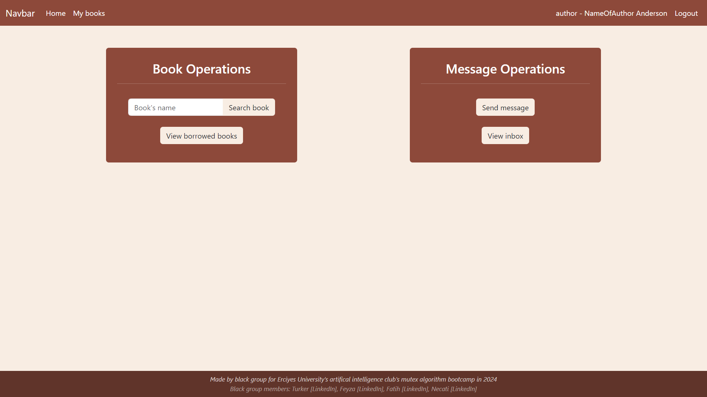
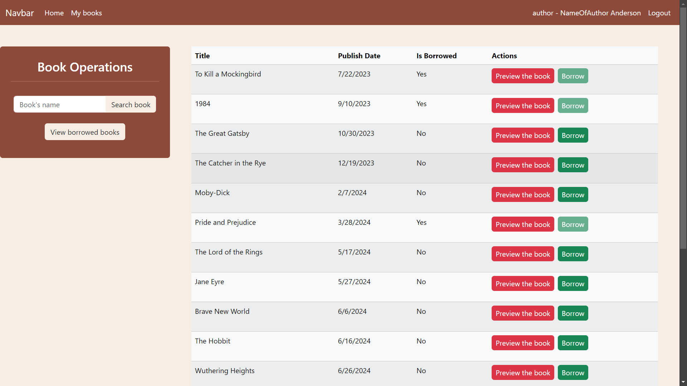
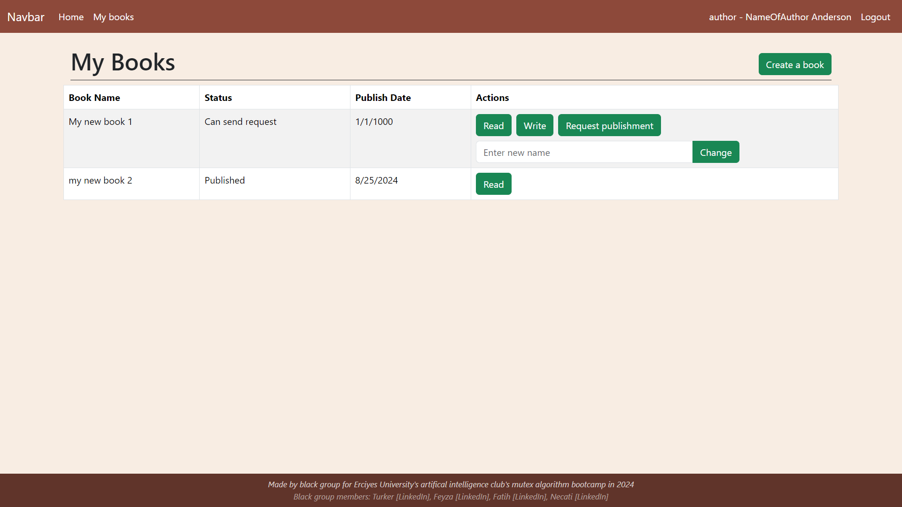
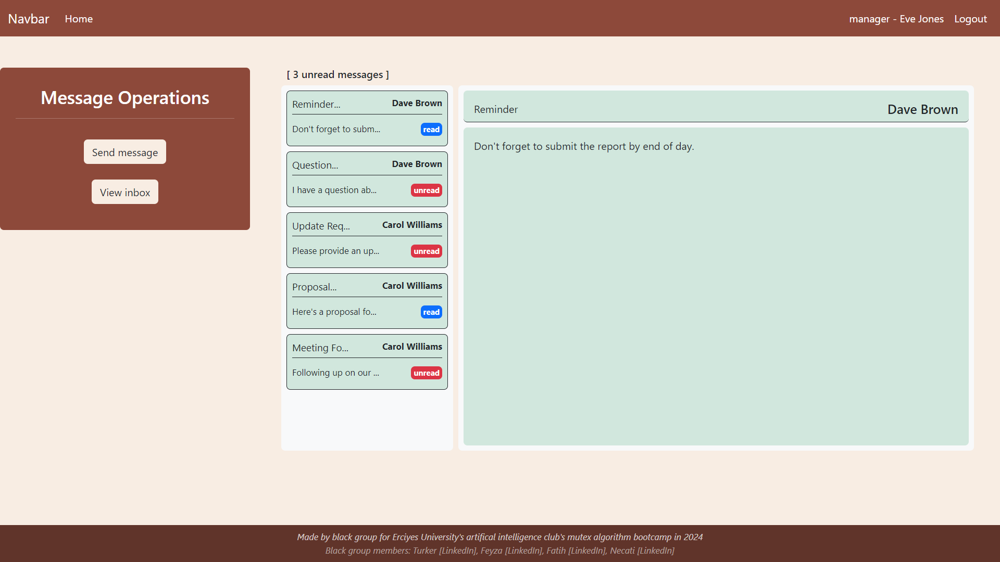
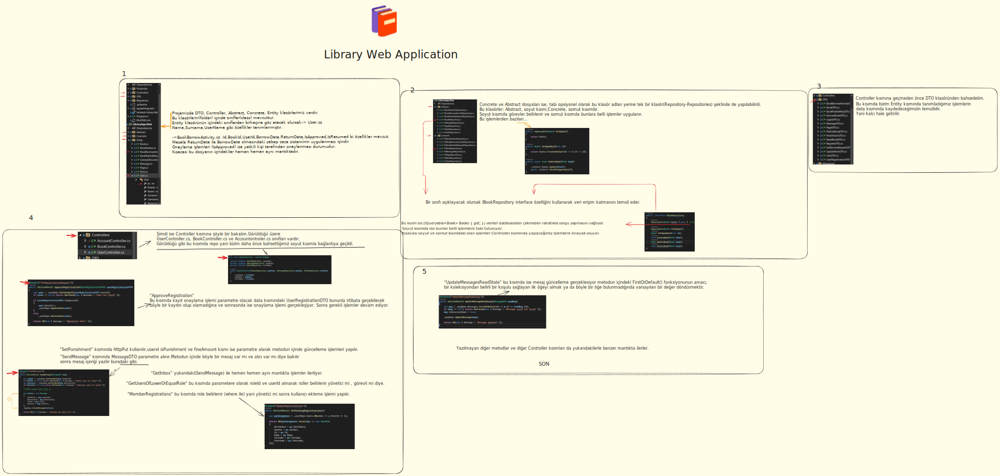

# 📚 Library Management Web App

Welcome to the Library Management Web App! This project is a full-stack application built with **.NET Web API** on the backend and **React** on the frontend. The app allows users to manage library resources, including books, authors, and user roles.

## 🚀 Features

- **Authentication & Authorization:** 
    - Secure login, role-based access, JWT authentication.
- **Member operations:** 
    - Search books.
    - Read or preview a book depending on if you borrowed or not.
    - Send and read messages.
- **Author operations**
    - Create book. 
    - Write or import page. 
    - Send publishment request.
    - And same operations as member.
- **Staff operations**
    - Approve/reject borrow requests.
    - Approve/reject member registirations.
    - And same operations as member.
- **Manager operations**
    - Change role of users. 
    - Punish users.
    - Approve/reject book publishment requests.
    - And same operations as staff.
- **Dynamic User Interface:** Responsive and user-friendly interface built with React.
- **Error Handling:** Robust error handling for both frontend and backend.

## 🛠️ Tech Stack

### Frontend
- **React**: JavaScript library for building user interfaces.
- **React Router**: For routing and navigation.
- **React Toastify**: For simple notification system.
- **Fetch**: Built-in JavaScript API for making HTTP requests.
- **Bootstrap**: CSS framework for responsive design.

### Backend
- **.NET 8 Web API**: Backend framework for building RESTful services.
- **Entity Framework Core**: ORM for database access.
- **PostgreSQL**: Relational database management system.

### Tools & Libraries
- **JWT**: For secure authentication.
- **Swagger**: API documentation.

## 🖥️ Getting Started

### Prerequisites

- **.NET SDK 8.0** or later
- **Node.js** (v20 or later)
- **PostgreSQL** installed and running

### Installation

1. **Clone the repository:**
   ```bash
   git clone https://github.com/EruAI-Mutex-Blacks/fullstack-library.git
   cd fullstack-library
   ```

2. **Setup Backend:**
   - Navigate to the `fullstack-library/LibraryApp.WebAPI` project directory.
   - Update the `appsettings.Development.json` with your PostgreSQL connection string.
   - Run the migrations to set up the database:
     ```bash
     dotnet ef database update
     ```
   - Run the API:
     ```bash
     dotnet run
     ```

3. **Setup Frontend:**
   - Navigate to the `fullstack-library/LibraryApp.ReactFrontEnd` directory.
   - Install dependencies:
     ```bash
     npm install
     ```
   - Start the React app:
     ```bash
     npm run dev
     ```

4. **View the app:**
   - Open your localhost link provided by npm.

## 🔗 API Endpoints

### Account
- **POST /api/Account/Login**: Authenticate a user and receive a JWT token.
- **POST /api/Account/Register**: Register a new user.

### Book
- **PUT /api/Book/SetPublishing**: Set the publishing status of a book.
- **GET /api/Book/BookPublishRequests**: Retrieve book publish requests.
- **POST /api/Book/RequestPublishment**: Request to publish a book.
- **GET /api/Book/SearchBook**: Search for books.
- **GET /api/Book/BorrowedBooks**: Retrieve borrowed books.
- **GET /api/Book/BorrowRequests**: Retrieve book borrow requests.
- **POST /api/Book/SetBorrowRequest**: Set a borrow request for a book.
- **POST /api/Book/BorrowBook**: Borrow a book.
- **GET /api/Book/GetBook**: Retrieve a specific book's details.
- **GET /api/Book/GetBooksByAuthor**: Retrieve books by a specific author.
- **POST /api/Book/WritePage**: Write a page for a book.
- **POST /api/Book/CreateBook**: Create a new book.
- **PUT /api/Book/UpdateBookName**: Update the name of an existing book.
- **PUT /api/Book/ReturnBook**: Return a borrowed book.

### User
- **PUT /api/User/SetRegistrationRequest**: Set a registration request for a user.
- **PUT /api/User/SetPunishment**: Set a punishment for a user.
- **POST /api/User/SendMessage**: Send a message to a user.
- **GET /api/User/GetInbox**: Retrieve the inbox of the logged-in user.
- **GET /api/User/GetUsersOfLowerOrEqualRole**: Retrieve users with a role lower or equal to the current user's role.
- **GET /api/User/GetUsersOfLowerRole**: Retrieve users with a role lower than the current user's role.
- **GET /api/User/MemberRegistrations**: Retrieve member registrations.
- **GET /api/User/GetAllRoles**: Retrieve all roles.
- **POST /api/User/UpdateMessageReadState**: Update the read state of a message.
- **PUT /api/User/ChangeRole**: Change a user's role.


To try endpoints, refer to the your **swagger**.

## 📷 Screenshots

### Manager home page


### Author home page


### Searching books page


### Author's books page


### Inbox page


## 📷 Additional guide with some codes

